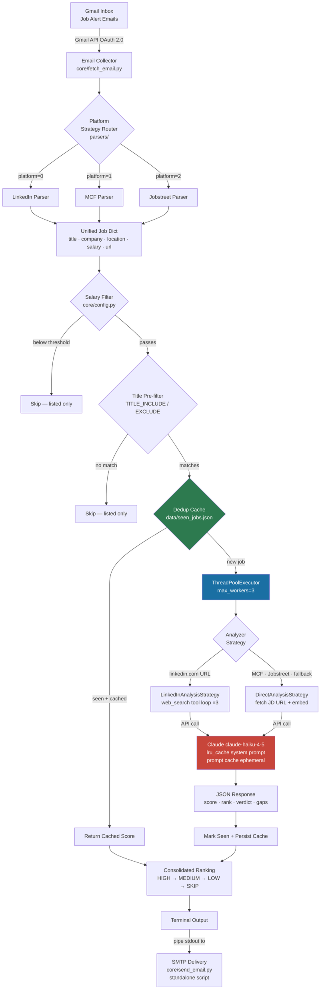

# Claude Job Matching Pipeline


An AI-powered pipeline that **reads job alert emails**, **extracts listings from LinkedIn, MyCareersFuture, and Jobstreet**, and **scores each posting against your resume using Claude AI** — surfacing only the roles genuinely worth applying for.

> **Why I built it:** Manual job hunting across three platforms means sifting through 50+ daily alerts by hand. This pipeline reduces that to a ranked shortlist in under 60 seconds, with a cost-per-run well under $0.05.

## Key Features

- **Multi-platform ingestion** — LinkedIn, MCF, and Jobstreet alerts parsed via a Strategy Pattern; adding a new platform is a two-file change
- **Cost-aware pre-filtering** — title regex and salary threshold gates run *before* any LLM call, cutting Claude API spend significantly
- **Dual analyzer paths** — LinkedIn uses Claude's `web_search` tool to fetch the live JD; MCF/Jobstreet embed the JD directly in a single-shot call
- **Prompt caching** — resume + instructions are marked `ephemeral` for Anthropic's prompt cache, achieving a ~10× reduction on the dominant token spend
- **Deduplication cache** — `seen_jobs.json` persists results across runs; re-running never re-analyses the same posting within 30 days
- **Concurrent analysis** — `ThreadPoolExecutor(max_workers=3)` parallelises Claude API calls across jobs
- **Token cost tracking** — per-run breakdown of input / output / cache-read / cache-write tokens with USD cost estimate

## Architecture



## Design Decisions

### 1. Strategy Pattern for parsers and analyzers

Both `parsers/` and `analyzers/` use an abstract base class (`ABC`) with concrete subclasses registered in a list. `main.py` iterates the list and calls the first strategy whose `matches()` returns `True`. Adding a new platform is a **two-file change** (new parser + register in `__init__.py`) with zero changes to orchestration code — Open/Closed Principle in practice.

### 2. Pre-filtering before LLM calls

Title regex (`TITLE_INCLUDE` / `TITLE_EXCLUDE`) and salary threshold checks are synchronous and run *before* any job enters the `ThreadPoolExecutor`. On a typical daily fetch of 60 listings this commonly reduces LLM calls to 15–20. The filter cost is negligible; the savings on token spend and latency are not.

### 3. Prompt caching on the system prompt

The combined resume + matching instructions prompt can exceed 4,000 tokens. Every API call marks the system prompt `cache_control: ephemeral`, instructing Anthropic's infrastructure to cache it across calls within the same session. Cache-read tokens cost $0.10/M vs $1.00/M for normal input — a 10× reduction on the largest token spend per call. The system prompt is also wrapped with `lru_cache` to avoid repeated file I/O across workers.

### 4. Dual analyzer paths

LinkedIn email alerts include only a short preheader snippet, not the full JD. `LinkedInAnalysisStrategy` lets Claude use the `web_search` tool in a multi-turn loop (up to 3 iterations) to locate and read the live JD. MCF and Jobstreet include the job UUID/URL, so `DirectAnalysisStrategy` fetches the JD via HTTP and embeds it in a single-shot prompt. The `DirectAnalysisStrategy.matches()` returns `True` as a catch-all fallback, ensuring no job is silently dropped.

### 5. Deduplication with result caching

`seen_jobs.json` is keyed by platform-specific job IDs extracted from URLs via per-platform regex patterns. Previous analysis results are stored alongside the dedup key, so re-running the pipeline within the 30-day TTL returns the cached score instantly — making daily incremental runs idempotent and cost-free for already-seen postings.

### 6. Bounded thread pool

`ThreadPoolExecutor(max_workers=3)` parallelises I/O-bound Claude API calls without overwhelming Anthropic's rate limits for the Haiku model tier. The system prompt is pre-warmed on the main thread (`_build_system_text()`) before the executor starts, so the `lru_cache` is populated once before any concurrent reads.

## Sample Output

```
============================================================
  CONSOLIDATED RANKING
============================================================

   1. [HIGH] Principal Software Engineer — Distributed Systems
       TechCorp Singapore | Score: 8.5/10 | Platform: MyCareersFuture
       Tech:Python,Go,K8s  Exp:8+ yrs  Domain:Fintech  Role:IC
       https://www.mycareersfuture.gov.sg/job/...

   2. [HIGH] Staff Engineer, Platform
       FinBank SG | Score: 8.1/10 | Platform: LinkedIn
       Tech:Java,AWS,Terraform  Exp:10+ yrs  Domain:Banking  Role:IC/Lead
       Gaps: Terraform certification, Java microservices at scale
       Strong culture fit; open-source contributions expected.
       https://www.linkedin.com/jobs/view/...

   3. [MEDIUM] Cloud Solutions Architect
       CloudCo | Score: 6.4/10 | Platform: LinkedIn
       Tech:AWS,Azure  Exp:5+ yrs  Domain:Enterprise  Role:Presales
       Gaps: Presales background, vendor certifications
       https://www.linkedin.com/jobs/view/...
```

## Project Structure

```
main.py                          # Entry point and orchestrator
core/
  config.py                      # Model name, platform IDs, title/salary filters
  fetch_email.py                 # Gmail API integration
  http_utils.py                  # HTTP helpers (SSL, HTML cleaning)
  seen_jobs.py                   # Job deduplication and result cache
  send_email.py                  # SMTP result delivery
  stats.py                       # Timing and token-cost tracking
  utils.py                       # Shared utilities
analyzers/
  base.py                        # Abstract AnalysisStrategy (ABC)
  direct.py                      # MCF/Jobstreet: fetch JD + single-shot Claude call
  linkedin.py                    # LinkedIn: web_search tool loop for live JD
parsers/
  base.py                        # Abstract EmailParser (ABC)
  linkedin.py                    # LinkedIn alert email parser
  mcf.py                         # MyCareersFuture alert email parser
  jobstreet.py                   # Jobstreet alert email parser
prompts/
  matching_instructions.md.example  # Template — copy and customise
resumes/
  README.md                      # Instructions for adding resume files
  *.md                           # ⚠ Your private resume files (gitignored)
data/                            # ⚠ Runtime cache (gitignored)
tests/                           # pytest suite — parsers, analyzers, cache, filters
```

## Setup

### 1. Clone and install dependencies

```bash
git clone <repo-url>
cd claude-job-matching-pipeline
pip install -r requirements.txt
```

### 2. Create `.env`

```ini
ANTHROPIC_API_KEY=sk-ant-...
SMTP_FROM=you@gmail.com
SMTP_PASSWORD=your-gmail-app-password   # Gmail App Password, not your account password
NOTIFY_EMAIL=you@example.com
```

### 3. Set up Gmail API credentials

1. Go to the [Google Cloud Console](https://console.cloud.google.com/) and create a project.
2. Enable the **Gmail API**.
3. Create an **OAuth 2.0 Desktop** client, download the JSON, and save it as `credentials.json` in the project root.
4. On first run the browser will open for OAuth consent; `token.json` is saved automatically.

### 4. Add your resume

```bash
cp resumes/README.md resumes/resume.md   # edit with your content
```

The resume path is configured via `RESUME_PATH` in `core/config.py` (default: `resumes/resume.md`). See [`resumes/README.md`](resumes/README.md) for the expected format. Resume files are gitignored.

### 5. Create your matching prompt

```bash
cp prompts/matching_instructions.md.example prompts/matching_instructions.md
```

Replace every `[PLACEHOLDER]` with your own scoring weights, domain preferences, priority bands, and keyword bonuses. This file is gitignored and never committed.

## Usage

```
python main.py [options]

Options:
  -p, --platform N [N ...]  Platforms to fetch: 0=LinkedIn 1=MCF 2=Jobstreet (default: all)
  -d, --days N              How many days back to fetch emails (default: 1)
  -a, --analyze             Score each job with Claude AI (default: list only)
  -s, --min-salary SGD      Skip jobs with listed salary below this monthly SGD amount
  -l, --limit N             Cap jobs sent to AI per platform (useful for testing)
  -v, --verbose             Print debug info: email counts, job counts per message
```

**Examples:**

```bash
# List today's jobs from all platforms (no AI scoring)
python main.py

# Full analysis — all platforms, salary ≥ SGD 8,000/mth
python main.py --analyze --min-salary 8000

# LinkedIn only, quick test with first 5 jobs
python main.py --platform 0 --analyze --limit 5

# Score all jobs from the past 3 days
python main.py --analyze --days 3 --verbose
```

## Configuration

### Title filters (`core/config.py`)

`TITLE_INCLUDE` and `TITLE_EXCLUDE` are lists of regex patterns applied to job titles **before** the AI is called. Use them to skip obvious mismatches cheaply.

```python
TITLE_INCLUDE = ["principal", "architect", "staff", "lead"]
TITLE_EXCLUDE = [r"\bjunior\b", "intern", "marketing"]
```

### Salary filter

Pass `--min-salary` at runtime. Jobs with no salary information are always passed through.

## Running Tests

```bash
pytest tests/
```

The test suite covers parsers, analyzers, deduplication logic, salary/title filters, and HTTP utilities.

## Privacy

The following are gitignored and must **never** be committed:

| Path | Contains |
|---|---|
| `.env` | API keys and SMTP credentials |
| `credentials.json` | Google OAuth client secret |
| `token.json` | Google OAuth access token |
| `resumes/*.md` | Personal resume files |
| `prompts/matching_instructions.md` | Your private scoring prompt |
| `data/` | Runtime cache (scored job results) |

## License

MIT
